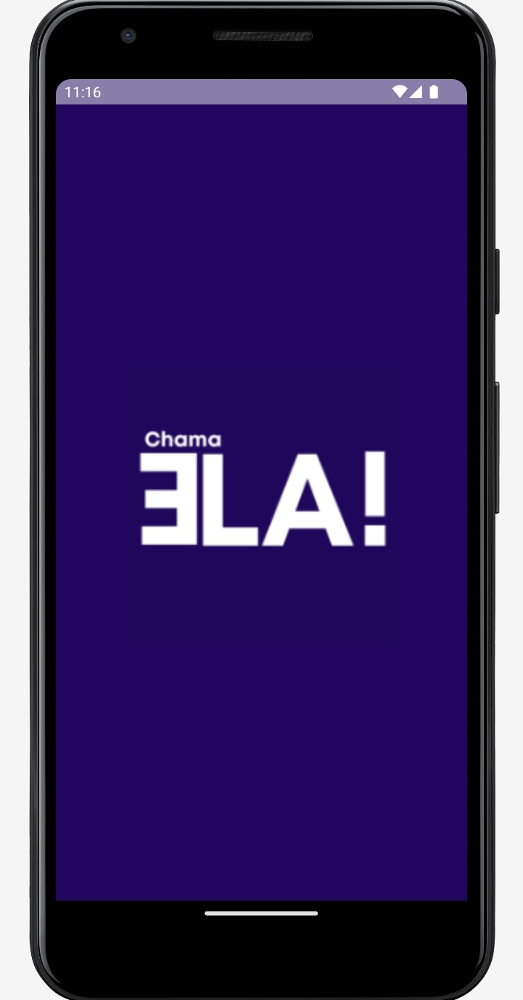
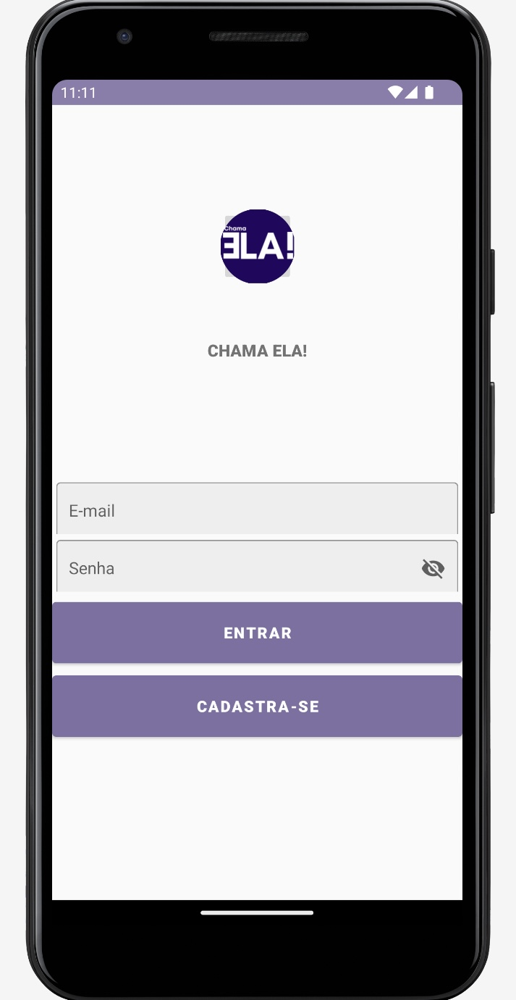
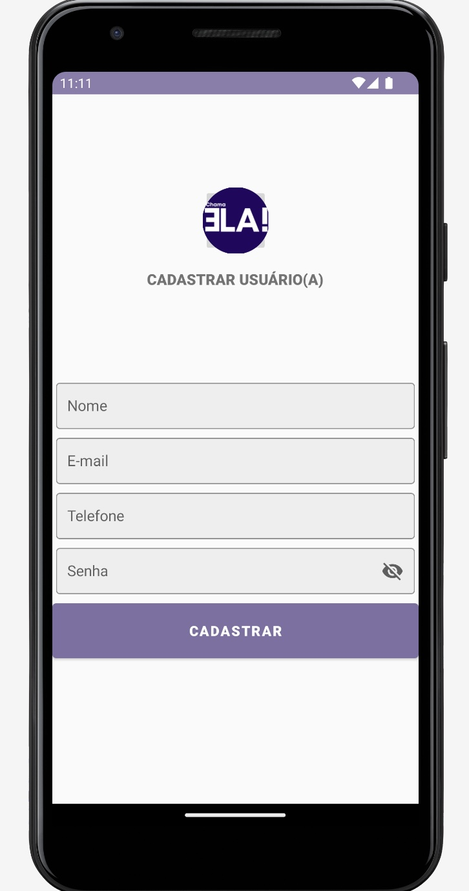
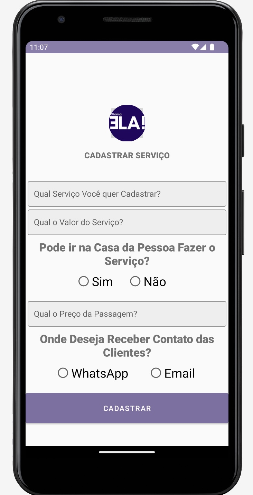
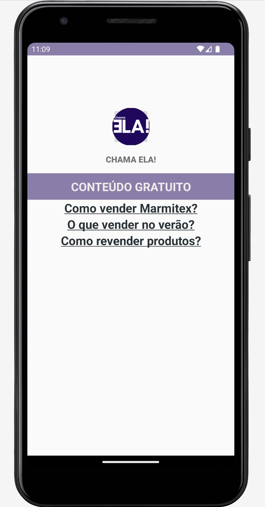

# Chama Ela! (pt-br)

Chama Ela! é um **aplicativo Android** focado em **ajudar mulheres em situação de relacionamento abusivo e que não possuem fonte de renda**.

Essas mulheres podem **divulgar seus serviços de forma gratuita** na plataforma.

Desse modo, essa mulher consegue levantar dinheiro suficiente para sair desse ambiente/relacionamento tóxico.

E caso essa mulher não possua nenhuma habilidade que possa cadastrar na plataforma, ela poderá **consumir conteúdo gratuito dentro da plataforma para desenvolver alguma habilidade**, e posteriormente **postar esse serviço na plataforma**.

A  plataforma cria um **ambiente seguro** onde **mulheres contratam serviços** de outras **mulheres**.

## Objetivo 

Ajudar **mulheres em situação de relacionamento abusivo** que **não possuem fonte de renda**.

E por conta da **falta de fonte de renda, ter filhos e nenhuma rede de suporte** elas acabam **não saindo desses relacionamentos abusivos**. Pois na maioria dos casos possuem filhos e nenhuma rede de apoio. 

## Diferencial

O **diferencial** da aplicação é ser uma iniciativa que **leva ajuda na palma da mão dessas mulheres**.

Pois **iniciativas governamentais e privadas** possuem grande **dificuldade em atingir esse público**. 

Porque grande parte das **iniciativas voltadas para mulheres que sofrem abuso** possuem uma **dinâmica onde a mulher deve buscar ajuda**.

**Mas como buscar ajuda quando sequer sei que preciso de ajuda?**

### Tecnologias & Tools

* Java Android;
* Material Design;
* Arquitetura MVC;
* Firebase;
* Gradle;
* Trello.

#### **Pitch:** https://www.linkedin.com/feed/update/urn:li:activity:7042168097633353728/

### Status: Em Desenvolvimento

## Telas

  
  
  
  
  
 

-------------------------------------------------------------------------------------------------------------------------------------------

# Chama Ela! (en)

Chama Ela! is an **Android application** focused on **helping women in abusive relationships and who have no source of income**.

These women can **advertise their services for free** on the platform.

In this way, this woman manages to raise enough money to get out of this toxic environment/relationship.

And if this woman does not have any skill that she can register on the platform, she can **consume free content within the platform to develop some skill**, and later **post this service on the platform**.

The platform creates a **safe environment** where **women hire services** from other **women**.

## Goal

Helping **women in abusive relationships** who **have no source of income**.

And because of the **lack of a source of income, having kids and no support network** they end up **not leaving these relationships**.

Either because they cannot support themselves financially, or because they don't want to put their children in a possible street situation.

## Differential

The **differential** of the application is that it is an **initiative that takes help on these women's hands**.

Because **government and private initiatives** have great **difficulty in reaching this public**.

Because most of the **initiatives focused in women who suffer abuse** have a dynamic where **the woman must seek help**.

**But how do I look for help when I don't even know I need help?**

### Technologies & Tools

* Java Android;
* Material Design;
* MVC architecture;
* Firebase;
* gradle;
* Trello.

### Status: Ongoing.

## Screens

  
  
  
  
  
 

<!-- 

Chama Ela! é um **aplicativo Android** voltado para **auxiliar mulheres de periferia e/ou baixa renda em situação de relacionamento abusivo e dependência financeira a obter fonte de renda**, através da **divulgação dos seus serviços** para sua vizinhança através da plataforma de **forma gratuita**.

Para que essa mulher consiga levantar dinheiro suficiente para sair desse ambiente/relacionamento tóxico.

E caso essa mulher não possua nenhuma habilidade que possa cadastrar na plataforma, ela poderá consumir conteúdo gratuito dentro da plataforma para desenvolver alguma habilidade, e posteriormente postar esse serviço na plataforma.

E a plataforma **cria um ambiente seguro** onde **mulheres contratam serviços** de outras **mulheres**.

Possuir uma área exclusiva para mulheres aprenderem de forma gratuita alguma habilidade que facilite ela levantar algum valor financeiro, de modo que consigam sair do relacionamento abusivo e reconstruir suas vidas em outro lugar.

A plataforma também abre possibilidade para mulheres disponibilizarem mentorias voluntárias para essas mulheres.

Dentro da área de ensino possuirá um mecanismo sutil para que essa mulher consiga entrar em contato com assistentes sociais, de modo que possam ter uma ajuda especializada dentro da lei.

Ajudar mulheres em situação de relacionamento abusivo a sairem desse contexto tóxico e reconstruírem a vida longe de seus abusadores.

Possibilitar essas mulheres a terem uma vida de verdade, e perceberem que existe muita coisa boa fora desse relacionamento abusivo para ser visto e aproveitado.

Existe vida fora de um relacionamento abusivo.

Aplicativo Android voltado para auxiliar mulheres de periferia e/ou baixa renda a obter uma renda extra, através da divulgação dos seus serviços para sua vizinhança através da plataforma. E caso não possua nenhuma habilidade que possa cadastrar na plataforma, esta disponibilizará conteúdo gratuito para que essas mulheres desenvolvam alguma habilidade e possam posteriormente disponibilizar na plataforma seus serviços 

English 

Chama Ela! is an **Android app** that has the main goal to **helping women from the periphery and/or low-income that are facing an abusive relationship to obtain a source of income**, by offering a digital plataform where they can post **their services** to their neighborhood **free of charge**.

So that this woman can raise enough money to get out of this toxic environment/relationship.

If this woman does not have any skill that she can register on the platform, she will be able to consume free content within the platform to develop some skill, and later post this service on the platform.

The platform **creates a safe** environment where **women hire services** from other **women**.

## Goal

Helping **women in abusive relationships** who **have no source of income**.

And because of the lack of a source of income, they end up not leaving these relationships. Because in most cases they have children and no support network.

So even if they identify that they are in an abusive relationship, they will hardly leave that relationship. 

Either because they cannot support themselves financially, or because they don't want to put their children in a possible street situation. 

Because in most cases theses women doesn't have a support network.

-->
